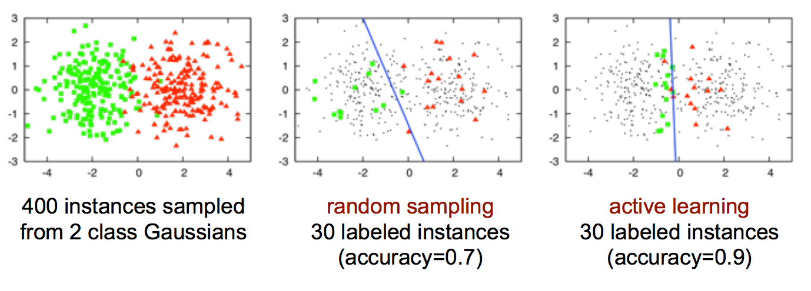
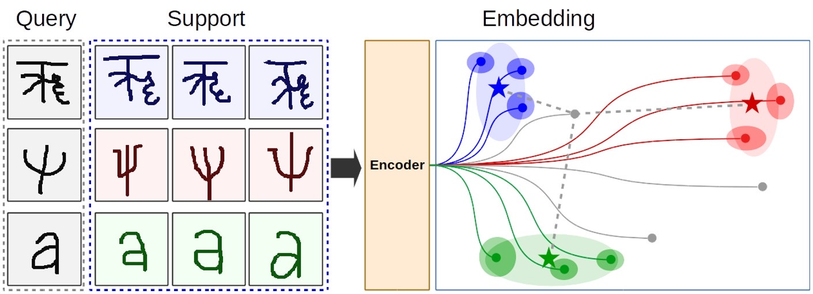

# Knowledge of the basic concepts in Master Thesis

## Active Learning

### What is Active Learning?

Active learning integrates human knowledge into machine learning, significantly reducing the amount of required labeled data and increasing the predictions of the model.

### How to reduce the labeling effort?

- select the most useful samples from the unlabeled dataset
- hand them over to the oracle (e.g. the human annotator) for labeling

### Why do we need it?

- Normally, we do not have enough (any) labeled data in our dataset
- Reduce the cost of data labeling without compromising performance

## Few-Shot Learning

### What is Few-Shot Learning?

A kind of machine learning algorithm, which can learn similar to how humans learn a new skill with just a few samples or even with just one sample.

### How to learn just with few samples?

- pre-trained model as encoder
- fine tuning with support set

- recognition based on the similarity

## Idea of the thesis

- Use the techniques of active learning to pick up the support set for few-shot learning
- Theoretically, the performance would be better and the learning efficiency would also be optimized